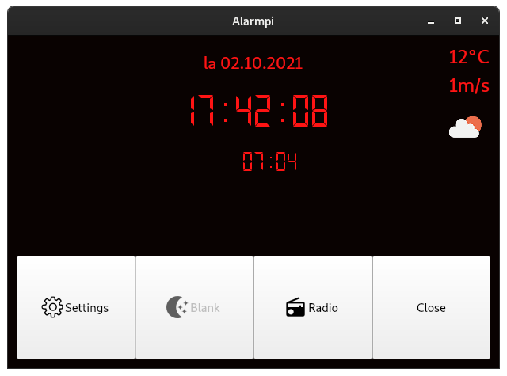

# Alarmpi

[](https://github.com/lajanki/alarmpi/actions/workflows/python-publish.yml)

A Raspberry Pi clock radio with customizable Text To Speech alarm.
```
Good afternoon, it's Wednesday September twelfth. The time is 07:29 PM.

Weather for today is Mostly Cloudy becoming rainy. It is currently 16 degrees  with a fresh breeze. The high for today is 17 and the low at 11 degrees. The sun rises at 06:43 AM and sets at 07:50 PM.

And now, The latest stories from the World section of the BBC News.

EU parliament votes to punish Hungary over 'breaches' of core values.
The European Parliament votes to punish Hungary for allegedly flouting EU values and the rule of law.

Hurricane Florence: Mass evacuation from 'storm of a lifetime'.
South Carolina authorities turn four motorways into one-way routes away from the coast.

Morocco bans forced marriage and sexual violence.
The new law criminalises sexual harassment and imposes tougher penalties on perpetrators.

Sri Lanka to ban Hindu animal sacrifice.
The ritual killing of animals such as goats could soon be outlawed at Sri Lanka's Hindu temples.


Thats all for now. Have a nice day.
```
[Play on SoundCloud](https://soundcloud.com/lajanki/pialarm_sample)


This is a fork of https://github.com/skiwithpete/alarmpi. After seeing it on [YouTube](https://youtu.be/julETnOLkaU), I thought it was neat and knew I wanted to use it to replace my old night table clock radio.


## Main Features
 * Alarm scheduling
 * A spoken greeting based on time of day
 * Reads the day's weather from openweathermap.org
 * Reads latest news from BBC World RSS feed
 * Plays internet radio streams
 




## Hardware setup
This project is built around the following hardware.
 * Raspberry Pi
 * [Official Raspberry Pi Touch Display](https://www.raspberrypi.com/products/raspberry-pi-touch-display/)
 * A speaker
 * A DHT22 temperature and humidity sensor (optional)

While this is built for a Rapsberry Pi, other Linux systems can be used for the main functionality. The GUI does have two bindings to a Raspberry Pi; buttons toggling screen brightness and turning it off completely are disabled on a non Pi system.

The DHT22 sensor is used for indoor temperature measurement and can be disabled from the configuration, see [configs/README.md](./configs/README.md).

It's also possible to run the alarm without the GUI on a headless setup, see _Usage_ below.


## Setup
First, install required system packages with  
```bash
sudo apt install qtbase5-dev ffmpeg festival vlc gpiod
```
These include the Qt5 development package, Festival text-to-speech engine and vlc media player.

Next, install Python packages with  
```bash
pip install -r requirements.txt
```
Using a virtual environment is recommended

Interacting with the Raspberry Pi's screen brightness is done via two system owned by the root user. The following udev rule will make them writable by all users (adapted from https://github.com/linusg/rpi-backlight).

```bash
echo 'SUBSYSTEM=="backlight",RUN+="/bin/chmod 666 /sys/class/backlight/%k/brightness /sys/class/backlight/%k/bl_power"' | sudo tee -a /etc/udev/rules.d/backlight-permissions.rules
```

### Troubleshooting install issues
Installing PyQt on a Raspberry Pi can be troublesome as it has to be compiled from source. In this case the installation may appear

to hang and, after a while be killed, due to a hidden prompt asking to accept its GPL license. In this case install it separately with
```bash
pip install PyQt5==5.15.10 --config-settings --confirm-license= --verbose
```
and then continue with the rest of the requirements as above.

> [!IMPORTANT]
> On an older Raspberry Pi model compiling from source can take a couple of hours.


## Usage
Run the script either with
```bash
python main.py [configuration_file]
```
where `[configuration_file]` is a path to a custom alarm configuration file, eg.
```bash
python main.py ~/alarm_config.yaml
```
If no argument is used the default configuration in, [./configs/default.yaml](./configs/default.yaml) will be used.


This opens a digital clock interface with current time as well a settings window for setting the alarm. On a Raspberry Pi the GUI can also be used to toggle screen brightness between high and low as well as turning it off entirely.

If the radio stream is enabled as part of the alarm it will be played in a separate process using `cvlc` command line media player.

When activated, the alarm works as a toggle; once it triggers, it will be deactivated and needs to be re-enabled in order to trigger again the next morning.

The optional configuration file can be used to customize the alarm as well as additional plugin based functionality, see [configs/README.md](./configs/README.md) for instructions.

You can also run a purely CLI version of the alarm with
```bash
python play_alarm.py [configuration_file]
```
You can use cron to manually schedule an alarm.

### Note about locales
While the TTS alarm is played in English, weekday and month names will be generated according to the runtime environment's current locale. If necessary, the relevant locale setting can be set to English with something like:
```bash
LC_TIME=en_GB.utf8 python main.py wakeup.yaml
```

## Unit tests
Unit tests can be run from the root folder with
```bash
pytest
```
